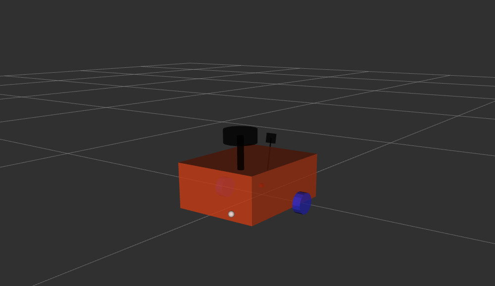
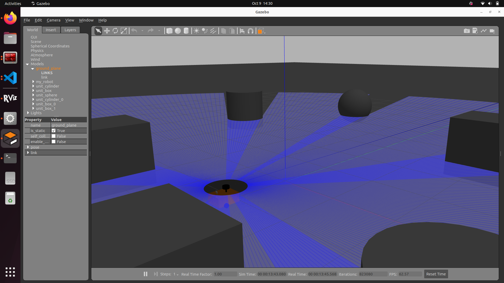

# RAV mobile robot 
---

Implementing NAV2 and SLAM on mobile robot with gazebo environment.

<div align="center">
	
</div>

## About

This repository contains a Gazebo simulation for a differential drive robot, equipped with an IMU, a depth camera, camera and a 2D LiDAR. The primary contriution of this project is to support ROS2 and nav2. Currently, the project supports the following versions - 

1. [ROS2 Humble + Gazebo Classic 11 (branch ros2)](#humble--classic-ubuntu-2204)

Each of the following sections describes depedencies, build and run instructions for each of the above combinations


## Humble + Classic (Ubuntu 22.04)

### Dependencies

In addition to ROS2 Humble and Gazebo Classic installations, we need to manually install [gazebo_ros_pkgs](https://github.com/ros-simulation/gazebo_ros_pkgs/tree/ros2) (since the same branch supports Classic and Fortress)

```bash
sudo apt-get install ros-humble-gazebo-ros-pkgs
```
Remainder of the dependencies can be installed with [rosdep](http://wiki.ros.org/rosdep)

```bash
# From the root directory of the workspace. This will install everything mentioned in package.xml
rosdep install --from-paths src --ignore-src -r -y
```

### Source Build

```bash
colcon build --packages-select rav_bot
```

### Run

To launch the robot in Gazebo,
```bash
ros2 launch rav_bot rav_gazebo.launch.py
```
To view in rviz,
```bash
ros2 launch rav_bot rviz.launch.py
```
### Configuration

The launch file accepts multiple launch arguments,
```bash
ros2 launch bcr_bot gazebo.launch.py \
	camera_enabled:=True \
	two_d_lidar_enabled:=True \
	stereo_camera_enabled:=False \
	position_x:=0.0 \
	position_y:=0.0 \
	orientation_yaw:=0.0 \
	odometry_source:=world \
	world_file:=small_warehouse.sdf \
	robot_namespace:="bcr_bot"
```
**Note:** To use stereo_image_proc with the stereo images excute following command: 
```bash
ros2 launch stereo_image_proc stereo_image_proc.launch.py left_namespace:=bcr_bot/stereo_camera/left right_namespace:=bcr_bot/stereo_camera/right
```
## Humble + Fortress (Ubuntu 22.04)

### Dependencies

In addition to ROS2 Humble and [Gazebo Fortress installations](https://gazebosim.org/docs/fortress/install_ubuntu), we need to manually install interfaces between ROS2 and Gazebo sim as follows,

```bash
sudo apt-get install ros-humble-ros-gz-sim ros-humble-ros-gz-bridge ros-humble-ros-gz-interfaces 
```
Remainder of the dependencies can be installed with [rosdep](http://wiki.ros.org/rosdep)

```bash
# From the root directory of the workspace. This will install everything mentioned in package.xml
rosdep install --from-paths src --ignore-src -r -y
```

### Source Build

```bash
colcon build --packages-select bcr_bot
```

### Binary Install
To install BCR bot in the binaries:

```bash
sudo apt-get install ros-humble-bcr-bot
```

### Run

To launch the robot in Gazebo,
```bash
ros2 launch bcr_bot ign.launch.py
```
To view in rviz,
```bash
ros2 launch bcr_bot rviz.launch.py
```

### Mapping with SLAM Toolbox

SLAM Toolbox is an open-source package designed to map the environment using laser scans and odometry, generating a map for autonomous navigation.

NOTE: The command to run mapping is common between all versions of gazebo.

To start mapping:
```bash
ros2 launch rav_bot mapping.launch.py
```

Use the teleop twist keyboard to control the robot and map the area:
```bash
ros2 run teleop_twist_keyboard teleop_twist_keyboard cmd_vel:=/bcr_bot/cmd_vel
```

To save the map:
```bash
cd src/bcr_bot/config
ros2 run nav2_map_server map_saver_cli -f bcr_map
```

### Using Nav2 with bcr_bot

Nav2 is an open-source navigation package that enables a robot to navigate through an environment easily. It takes laser scan and odometry data, along with the map of the environment, as inputs.

NOTE: The command to run navigation is common between all versions of gazebo.

To run Nav2 on bcr_bot:
```bash
ros2 launch bcr_bot nav2.launch.py
```


### Simulation and Visualization
1. Gazebo Sim (classic Gazebo) (obstacle World):
	

2. Gazebo Sim (classic Gazebo) (warehouse World):

3. Rviz :
	

### further plans
* plan to use this simulation with rav2 and use to get some more tutorial on it with plannars, behaviors and learn more.
* use Hardware to integrate with same urdf design (hardware project will be in another repo).